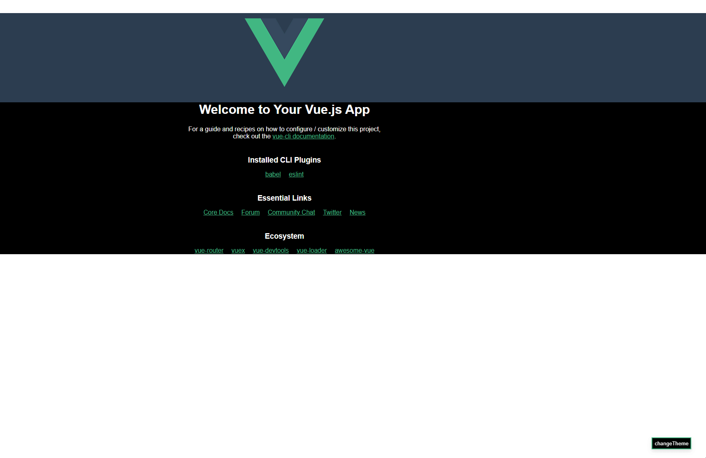

# vue-theme-switcher

> This is a simple vue theme switch project(这是一个简单的vue主题切换项目),If you want a way to freely customize all
> styles you can use this,Rather than saying that this is a tool, it is better to say that this is an idea of a theme
> switching

### Four steps u need to do:

- Configure all theme styles in the specified directory or url,like this(put ur css files in `dark` or `light` floder):

```shell
├─public
│  └─css
│      ├─dark
│      └─light
└─src
    ├─assets
    ├─components
    └─utils
```

- Init theme switcher in `main.js`:

```javascript
function renderApp() {
    const app = createApp(App).use(initTheme({
        localCssBasePath: '/css',
        // remoteCssBaseUrl:'https://xxxx/css',
        defaultTheme: theme.light,
        baseCss: ['base.css'],
        themeCss: ['app.css', 'hello-world.css']
    }));
    app.mount('#app');
}
```

`localCssBasePath`:the local css files base floder  
`remoteCssBaseUrl`: the remote css files base url-path  
`defaultTheme`: default theme to start  
`baseCss`: some common css files path  
`themeCss`: css files containing different theme styles

- Define a function for overloading styles in `App.vue`:

```html

<template v-bind:="needReload" class="main">
    <SimpleDemo/>
</template>

<script setup>
    import {nextTick, provide, ref} from "vue";
    import SimpleDemo from "@/components/SimpleDemo";

    const needReload = ref(false);

    async function reload() {
        needReload.value = true;
        await nextTick(() => {
            needReload.value = false;
        })
    }

    provide('reload', reload);
</script>
```

- call `changeTheme` function to start changing theme:
```html

<template>
    ---
      <button class="theme-change-btn" @click="onChangeTheme">
        changeTheme
      </button>
    ---
</template>

<script setup>
import {inject} from "vue";
import {changeTheme} from "@/utils/theme/themeswitcher";
const reload = inject('reload');

function onChangeTheme() {
  changeTheme(() => {
    console.log('start changing theme');
  }, () => {
    reload();
    console.log('end changing theme');
  });
}
</script>
```
#### demo gif:
